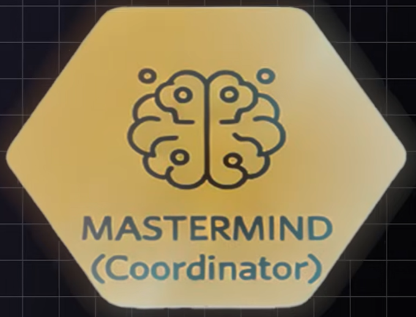
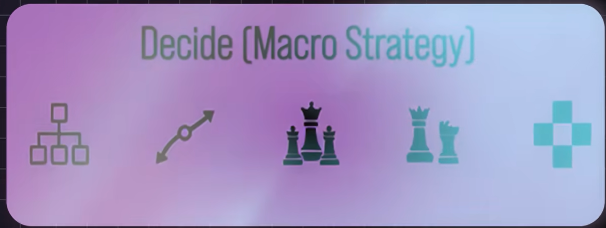
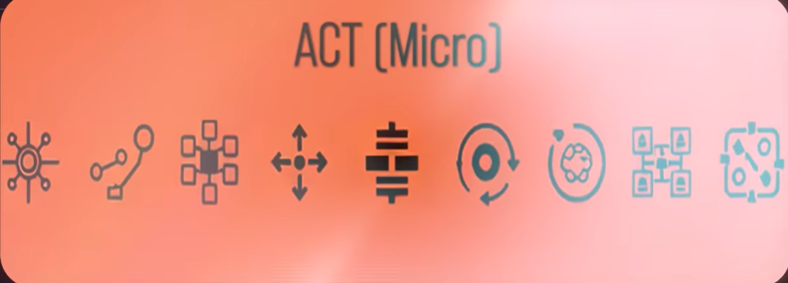

# A "thinking" StarCraft II bot

## Concept

Right now the bot is one function: `CompetitiveBot.on_step` in `bot/bot.py` reads game state,
decides what to build, and issues actions all in the same if/elif ladder. That works while the
bot only knows a handful of rules, but it doesn't scale: every new rule has to know about every
other rule's state, and there's no single place that could answer "what is this bot actually
trying to do right now?"

The idea below splits that one function into four narrower jobs, each of which only has to reason
about its own layer, plus one coordinator that keeps them in sync frame to frame. This doc records
the intent and a rough target shape for that split. It is not a refactor commitment: the current
`bot.py` keeps working as-is until pieces are pulled out deliberately, one at a time.

## Data flow, once per step

```
on_step
  -> Vision.observe(bot)        produces a world-state snapshot
  -> Mastermind.decide(world)   asks Strategy for the current plan
       -> Strategy.evaluate(world)   returns a set of intents (build X, defend, push, ...)
  -> Mastermind.act(intents, world)  hands intents to Micro
       -> Micro.execute(intents, world)   issues the actual python-sc2 calls
```

Vision and Strategy only ever read state; Micro is the only layer that calls action APIs like
`self.train(...)`, `self.build(...)`, `unit.attack(...)`. Mastermind is the only layer that calls
the other three — Vision, Strategy, and Micro never call each other directly.



## Mastermind (Coordinator)

Keeps the other three layers in sync. It runs once per `on_step`, in the fixed order shown above,
and is the arbiter when layers disagree — e.g. Strategy wants to expand but Micro reports no idle
worker is available, or Strategy calls for a push while Vision's world-state says a bigger enemy
army just became visible near home.

- **Input:** nothing of its own — it just wires Vision -> Strategy -> Micro together each step.
- **Output:** nothing directly; its job is sequencing and conflict resolution, not decisions.
- **Today:** doesn't exist as a concept. `on_step` itself is the de facto coordinator — the order
  of the if/elif chain in `bot/bot.py` *is* the current (implicit) arbitration logic.
- **Open question:** what does "keep in sync" mean concretely beyond ordering? At minimum it needs
  to detect stale/conflicting intents (Strategy asking for something Micro can't currently do) and
  either drop, defer, or re-ask for a decision — that policy isn't designed yet.



## Decide (Macro Strategy)

Picks a plan for the current game state and expresses it as intents (e.g. "expand", "build
spawning pool", "defend home", "push with current army") rather than executing anything itself.

- Where am I in the tech tree?
- What have my opponents been doing?
- Historical categorization of what has been happening
- Am I on the losing side?
- Should I defend or push?

- **Input:** the world-state snapshot from Vision (own tech/army/economy state, visible enemy
  state, map info).
- **Output:** a set of intents for Micro to carry out.
- **Today:** this is most of what `on_step` currently does inline —
  `should_train_overlord`/`should_train_zergling`/`should_build_spawning_pool`/`should_train_drone`
  and the "12 idle zerglings -> attack enemy start" rule are all Strategy decisions, just made
  directly against `self.*` state instead of against a Vision snapshot, and executed immediately
  instead of returned as an intent.
- **Open questions:** "am I on the losing side?" needs some notion of relative strength (army value,
  economy, tech) — nothing tracks this yet. "Historical categorization of what has been happening"
  and "what have my opponents been doing" imply persisting observations across steps (and ideally
  across games against the same opponent) — there's no storage for this today; everything in
  `bot.py` is recomputed fresh from live game state every step.



## Act (Micro)

Turns intents into concrete game actions. The long-term goal stated for this layer is that for
every ability of every unit there's an explicit instruction on how to use it effectively — i.e.
this is where unit-level tactics (when to burrow, when to kite, when to focus-fire, when to split
against splash) eventually live, not just "attack-move at a location."

- **Input:** the intents from Strategy (via Mastermind) plus the world-state snapshot (unit
  positions, cooldowns, enemy composition).
- **Output:** actual `python-sc2` calls — `self.train(...)`, `await self.build(...)`,
  `unit.attack(...)`, ability usage.
- **Today:** `train_if_affordable` and `build_if_affordable` in `bot/bot.py` are already close to
  the target shape for this layer — small, focused execution helpers. The "send idle zerglings to
  attack enemy start location" block is the only real unit-control logic that exists so far, and
  it's a placeholder: one blanket `attack()` order per unit, no per-ability or per-matchup
  behavior yet.
- **Open question:** none of the "instruction per ability" behavior exists yet for any unit type —
  this layer today only knows how to train/build/attack-move.


## See (Perception)

Reads the map and turns raw observation into something the other layers can use without each of
them re-deriving it from `self.units`/`self.enemy_units`/`self.structures` independently.

- Clusters of units
- Understanding enemy strength when they see clusters
- How it sees the map
- Funneling the info into a way that is easy to parse

- **Input:** whatever `BotAI` exposes per step (own units/structures, currently-visible enemy
  units/structures, map data).
- **Output:** a world-state snapshot object that Strategy and Micro both read from.
- **Today:** doesn't exist as a separate step. `bot.py` calls `self.units`, `self.townhalls`,
  `self.gas_buildings`, etc. directly and inline (e.g. `ideal_worker_count`), scattered across
  whichever method happens to need them.
- **Open questions:** "clusters of units" and "understanding enemy strength when they see clusters"
  both need an actual grouping/strength-estimation algorithm — nothing like that exists yet, so
  this is the layer with the most net-new logic to design, not just extract from `bot.py`.

## Suggested build order

The project is early-stage and `bot.py` currently plays a full game end-to-end, so the goal is to
peel layers out one at a time without ever leaving the bot in a non-working state:

1. **Vision first.** Introduce a `WorldState`-style snapshot object built once per step from
   existing `BotAI` state. Nothing behavioral changes yet — `bot.py` just reads from the snapshot
   instead of `self.*` directly.
2. **Micro next.** `train_if_affordable`/`build_if_affordable` already fit; move them (and the
   idle-zergling attack logic) into a dedicated module that takes intents in, rather than being
   called inline from `on_step`.
3. **Strategy third.** Replace the `should_train_*`/`should_build_*` if/elif ladder with a function
   that reads the Vision snapshot and returns intents, instead of deciding-and-acting inline.
4. **Mastermind last.** Once Vision/Strategy/Micro exist as separate pieces with a clean intent
   boundary between Strategy and Micro, wire them together behind a thin coordinator and shrink
   `on_step` down to calling it.

Each step should leave `bot.py` fully playable — this is meant as an incremental extraction, not a
rewrite.
